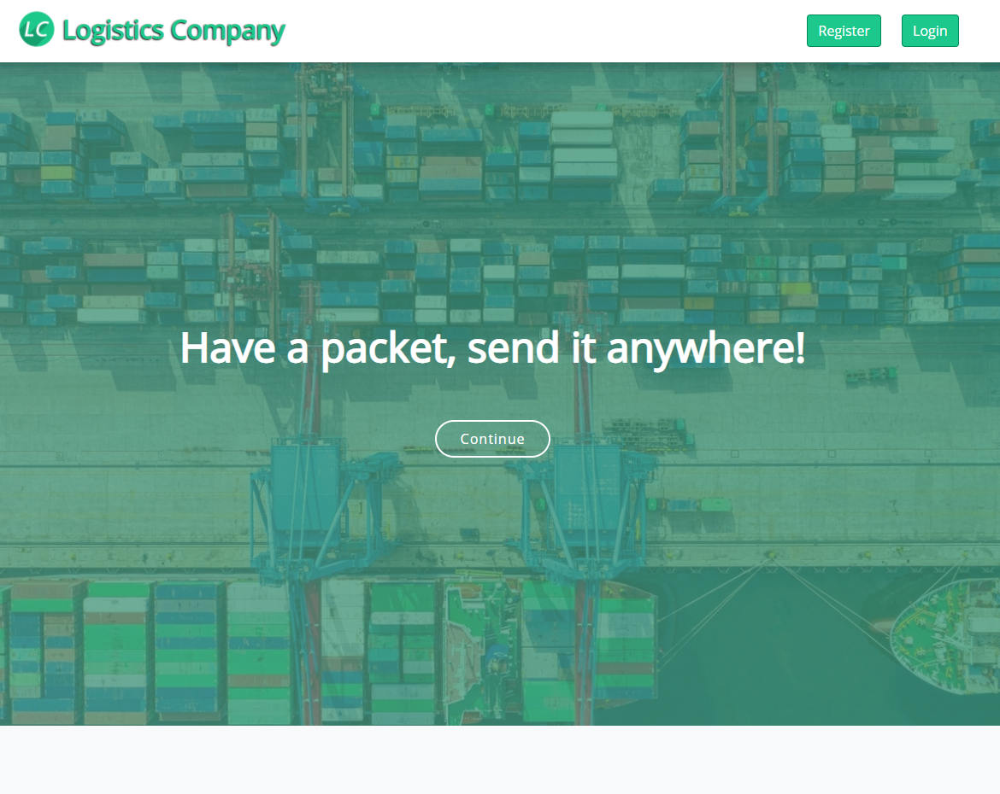
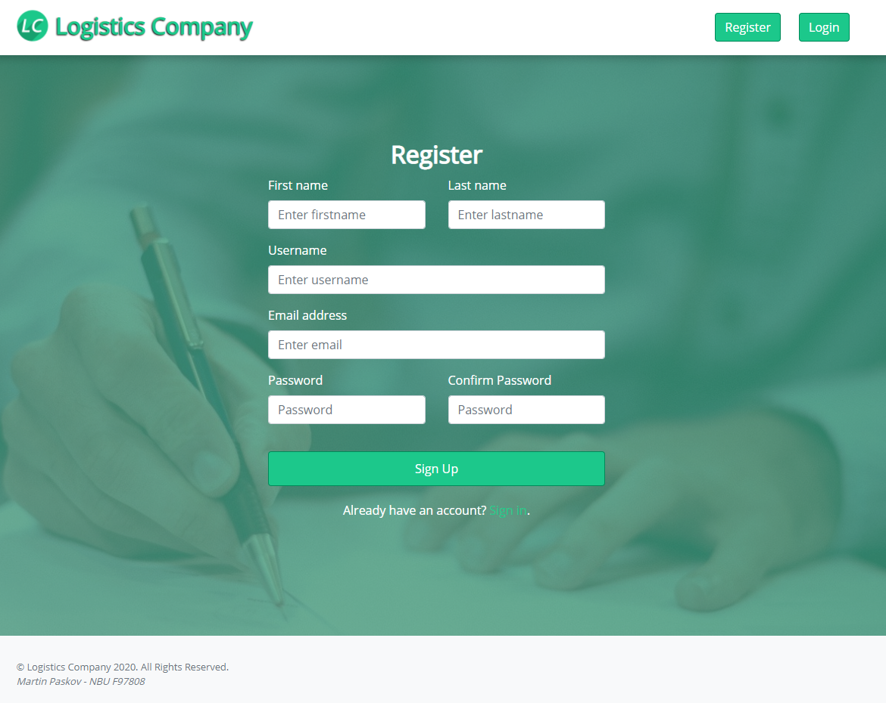
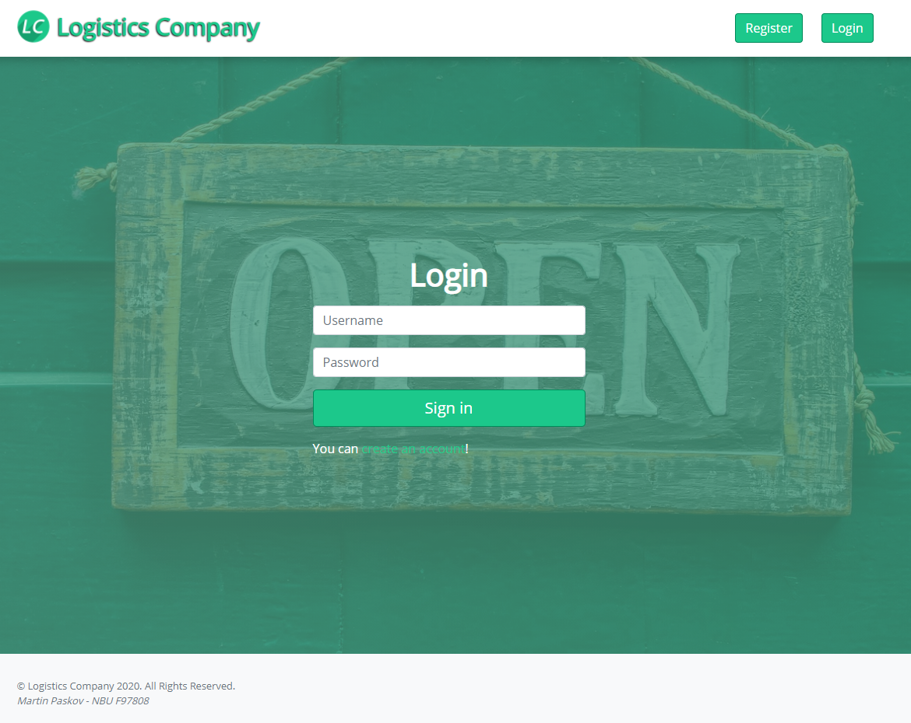
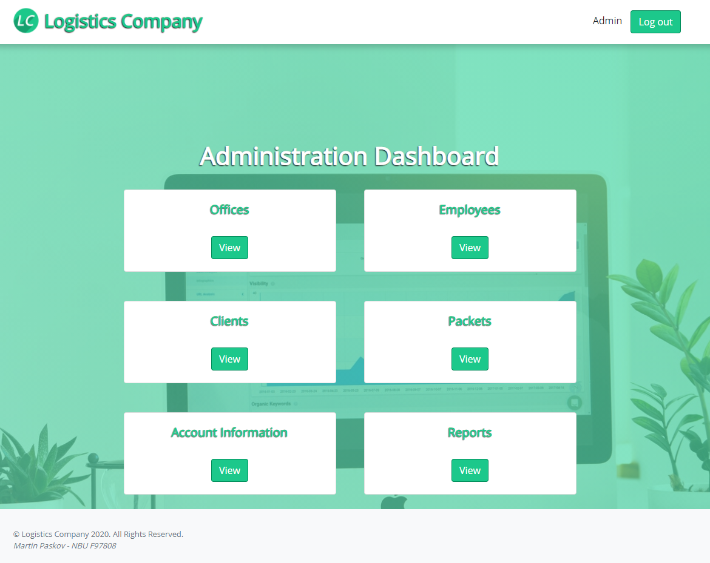
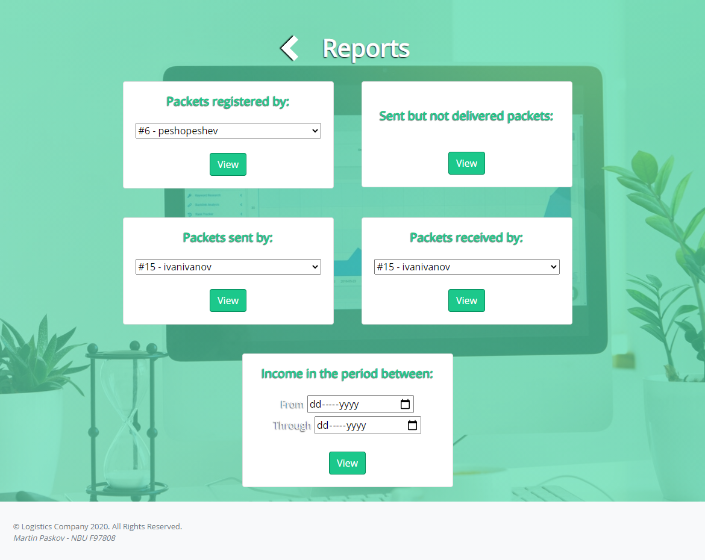
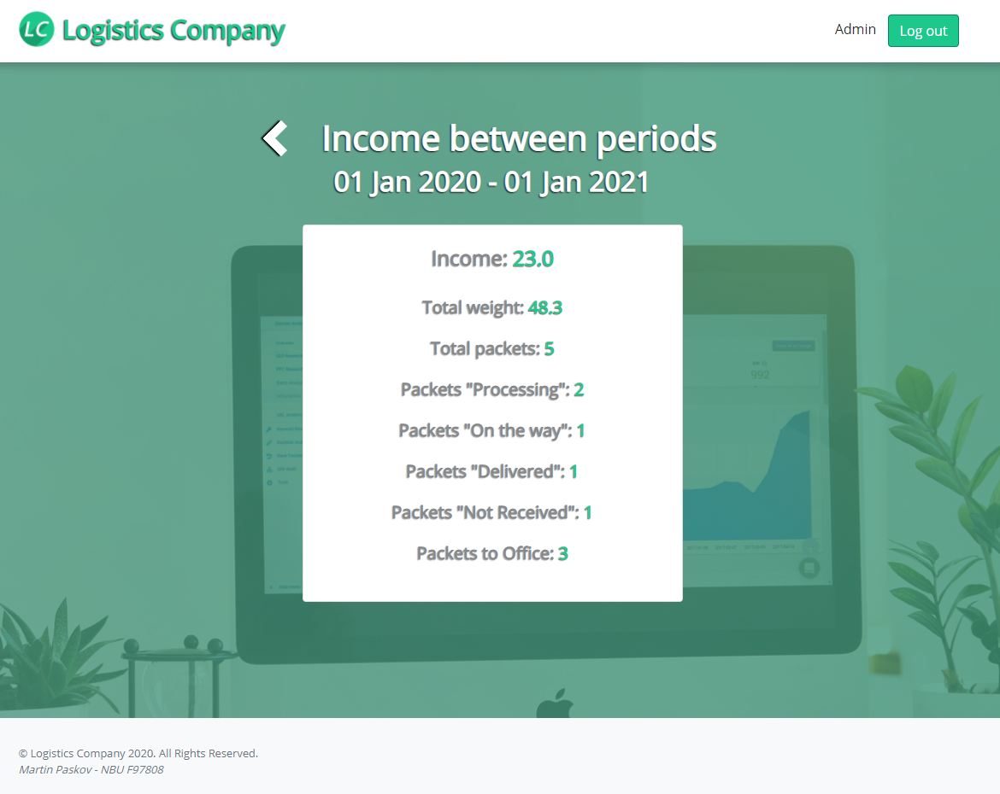
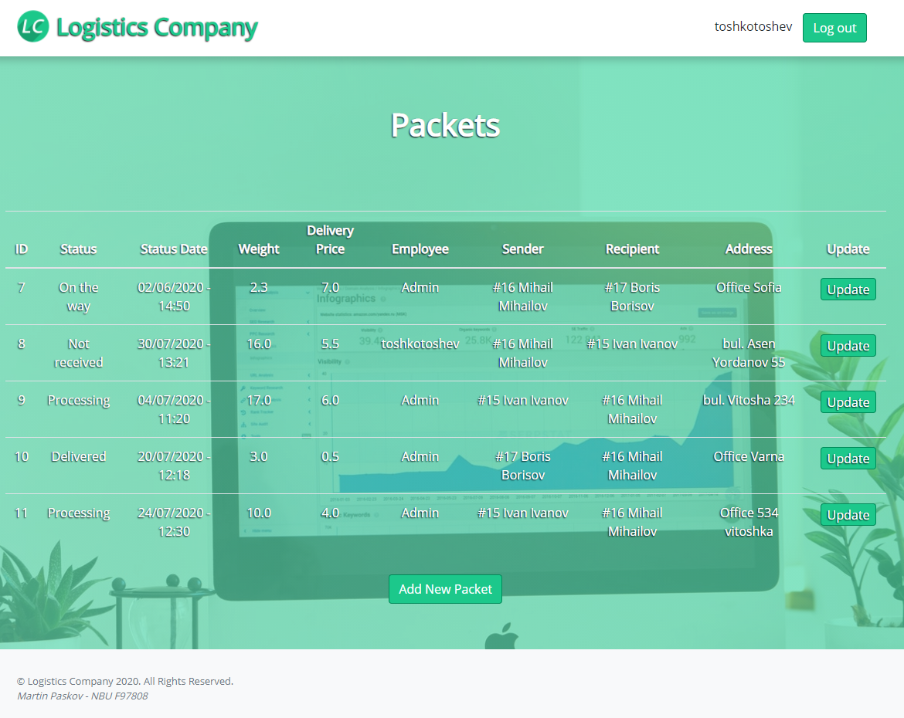
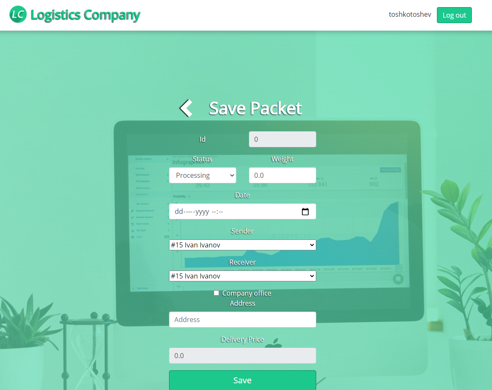
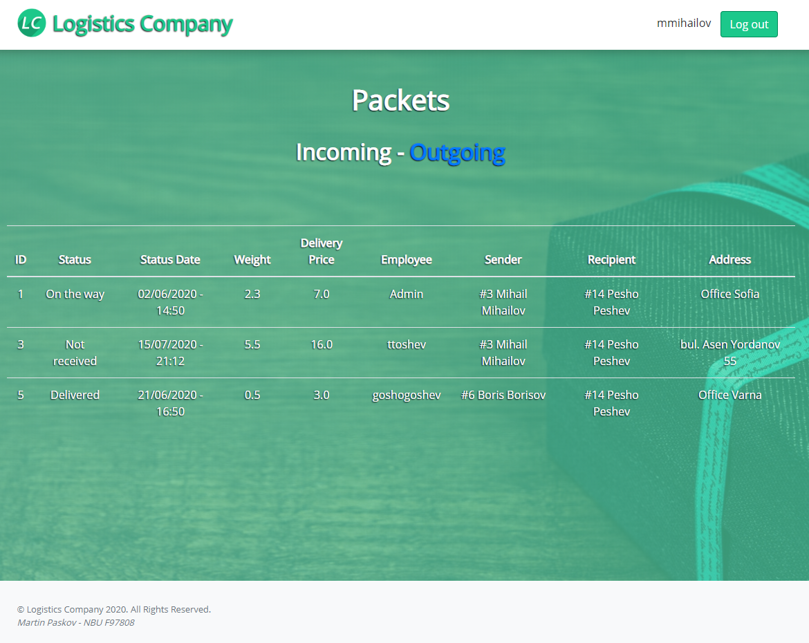
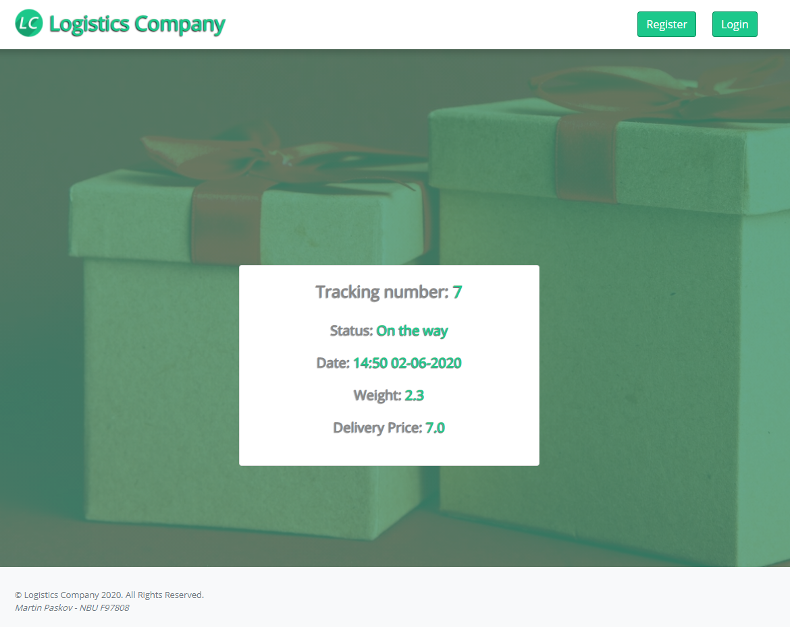

# Logistics Company Web Application

[](LICENSE)

The application provides a company the opportunity to organize its offices, employees, clients and packets.
The project utilizes Spring Boot, Tomcat, MySQL, JPA, Thymeleaf.

It features 3 different parts:

> Administration Dashboard

*	Main Dashboard with all functionalities
*   CRUD operations for Offices
*   CRUD operations for Employees
*   CRUD operations for Clients
*   CRUD operations for Packets
*	Admin password change (due to the initial admin password being temppass)
*	Report Dashboard
*	Report for: Packets registered by a specific employee
*	Report for: Sent but not delivered packets
*	Report for: Packets sent by a specific client
*	Report for: Packets received by a specific client
*	Report for: All income in a given time period


> Employee Dashboard

*   Read all packets
*   Packet creation
*   Packet update


> Client Dashboard

*   Read all incoming packets to the current client
*   Read all outgoing packets to the current client


> Free access services

*   Registration
*   Login
*   Track a packet by number


## Prerequisites
* Java 8 or higher.
* Gradle
* Spring Boot
* TomcatWebServer
* MySQL
* JPA
* Thymeleaf

## Installation

Navigate to a new folder of your choice. Clone this repository.
```git
git clone https://github.com/kartaggen/logistics-company.git
```

Run "db/logistics-company DB.sql" script in MySQL. Initialize a user to access that database and update the "application.properties" with the "spring.datasource.url", "spring.datasource.username" & "spring.datasource.password".


## Screenshots
Homepage |Registration page
---------------------|-----------------
 | 

Login Page|Administration Dashboard
---------------------|-----------------
 | 

Report Dashboard|Income Report
---------------------|-----------------
 | 

Employee Dashboard|Packet creation
---------------------|-----------------
 | 

Client Dashboard|Tracking Service
---------------------|-----------------
 | 
